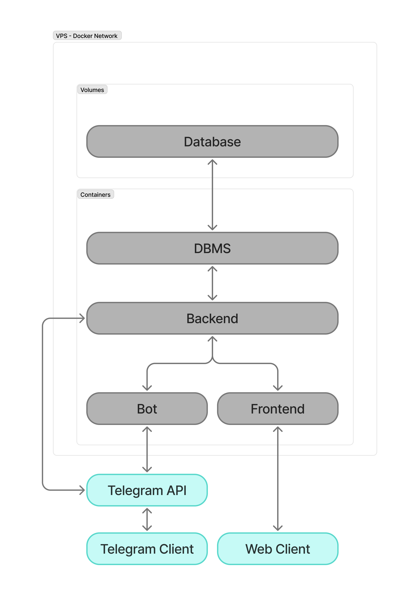

About
======
This is a pet project targeted mostly to master FastAPI framework. Side goals - to build Telegram bot and its admin panel frontend.  

Stack
======
* Python 3.12
* Backend - FastAPI & SQLAlchemy & Alembic
* Frontend - Nicegui
* Bot - Aiogram
* Common elements - Pydantic & Pydantic Settings & Loguru

Architecture
======
<p align="center">
    
</p>

Deployment
======
Local deployment
------
There are 3 separate applications to be installed - backend, frontend and bot.

1. Create and activate virtual environment
```shell
python3.12 -m venv venv
. venv/bin/activate
```
2. Install dependencies from `requirements.txt`
```shell
pip install -r src/backend/requirements.txt 
pip install -r src/frontend/requirements.txt 
pip install -r src/bot/requirements.txt 
```
3. Fill `infra/.env` using `.env.example`
4. Set the base directory - for the subproject you want to start
```shell
cd src/backend
```
5. For backend - apply migrations from `src/backend`
```shell
alembic upgrade head
```
6. For backend - create the first admin
```shell
python create_admin.py -u <username> -p <password>
```
7. Start the project
```shell
python main.py
```

Local deployment in containers
------
1. Build the images:
```shell
docker build -t hrbot_backend -f ./infra/Dockerfile_backend .
docker build -t hrbot_frontend -f ./infra/Dockerfile_frontend .
docker build -t hrbot_bot -f ./infra/Dockerfile_bot .
docker build -t hrbot_gateway -f ./infra/Dockerfile_gateway .
```
2. Run docker network:
```shell
docker compose -f infra/docker-compose.yml up
```
Pay attention that yml-file contains links to the specific env-variables for DB creation. 
3. Inside backend container - apply migrations
```shell
alembic upgrade head
```
4. Inside backend container - create the first admin
```shell
python create_admin.py -u <username> -p <password>
```

Deployment in production
------
1. Build the images locally:
```shell
docker build -t galsrv/hrbot_backend -f ./infra/Dockerfile_backend .
docker build -t galsrv/hrbot_frontend -f ./infra/Dockerfile_frontend .
docker build -t galsrv/hrbot_bot -f ./infra/Dockerfile_bot .
docker build -t galsrv/hrbot_gateway -f ./infra/Dockerfile_gateway .
```
2. Push the images to Docker Hub
```shell
docker push galsrv/hrbot_backend
docker push galsrv/hrbot_frontend
docker push galsrv/hrbot_bot
docker push galsrv/hrbot_gateway
```
3. Put `.env` and `docker-compose.production.yml` in the project directory at the server. Check `.env` content, adjust. 

4. Adjust external nginx configration
Edit `/etc/nginx/sites-available/default`
Check confirugation `nginx -t`
Reload nginx `systemctl reload nginx`

5. Run docker network from project directory:
```shell
docker compose -f docker-compose.production.yml up -d --pull always
```
6. Inside backend container - apply migrations
```shell
docker exec hr_bot-hrbot_backend-1 alembic upgrade head
```
7. Inside backend container - create the first admin
```shell
docker exec hr_bot-hrbot_backend-1 python create_admin.py -u <username> -p <password>
```

Features implemented
======
* FastApi backend
* SQLAlchemy ORM
* Alembic migrations
* Pydantic models, whenever possible
* Dependencies
* Background tasks & Lifespan tasks
* Pagination
* Separate frontend application based on Nicegui
* Frontend communicating with backend by REST API
* Authentication through sessions & cookies - self-made, just to try it
* Logging

Known limitations
======
* Error pages for Nicegui are not customized
* Constants and validators are duplicated at backend and frontend
* Autotests don't exist
* Telegram username change is not processed


